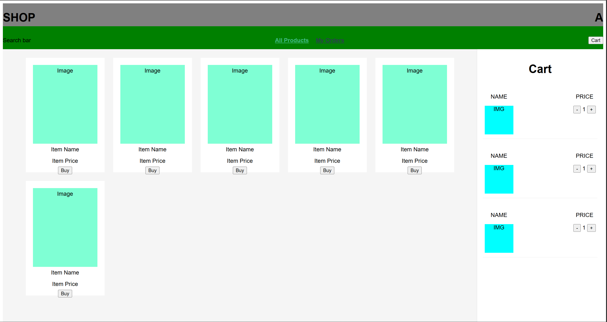

# Shop Frontend Rebuild

This is a small Vue project where I am rebuilding a shop project that I previously made in Angular. The goal is to learn Vue 3 by recreating the same kind of functionality using the Vue ecosystem.

## Current Status

I have set up the basic app structure with Vue Router and a simple layout.

Current files/components:

- `MainLayout.vue` wraps the main page structure
- `TopBar.vue` handles the header
- `NavBar.vue` handles navigation
- `ProductsView.vue` displays the products page
- `OrdersView.vue` is a separate route
- `ProductCard.vue` displays a product card
- `CartSideBar.vue` shows the cart on the right side
- `CartCard.vue` displays an item inside the cart

Current routes:

- `/` shows products
- `/orders` shows orders

## Progress Screenshots

2026-05-09

## What Works

The products page renders multiple product cards in a grid. The app layout includes a top bar, a navbar, and a cart sidebar on the right side. Navigation between products and orders has been started with Vue Router.

The cart is currently static and shows hardcoded cart cards.

## Next Steps

The next step is to connect the frontend to the backend and load products from the API instead of hardcoding them.

I also want to add Pinia for state management, mainly for:

- products
- cart
- orders
- loading/error state

The goal is to be able to click “Buy”, add products to the cart, update quantity, and later create orders through the backend.

## Notes / Things Learned So Far

So far I have practiced Vue components, routing, layout structure, scoped CSS, file structure, and the difference between views and components.

I also ran into some common issues with filename casing and line endings on Windows, which was useful to debug.
